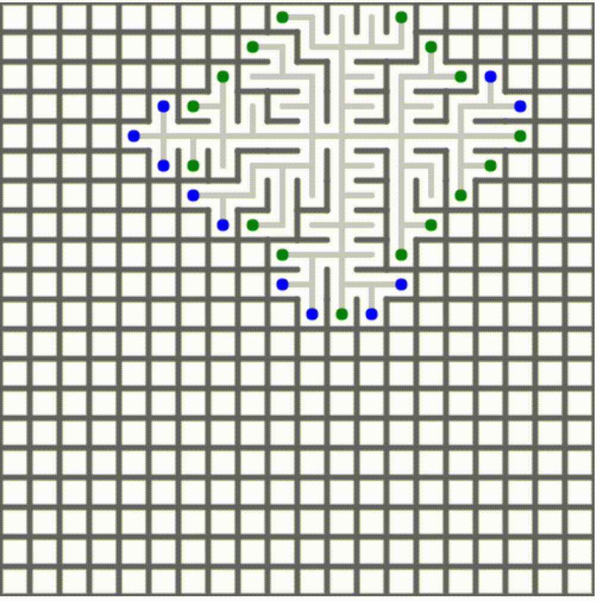
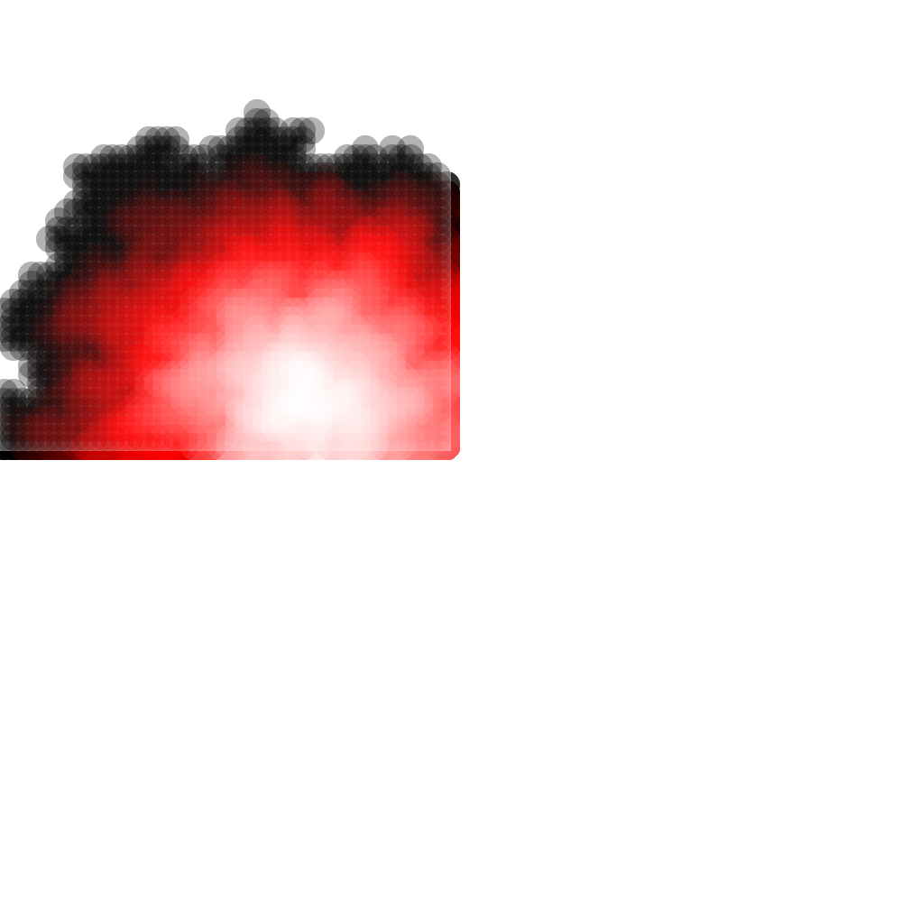
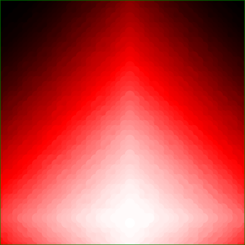
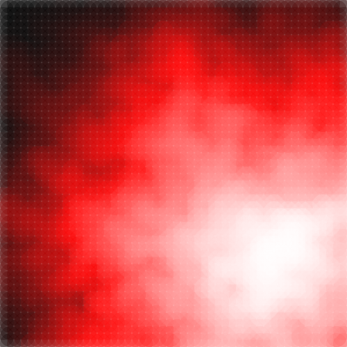
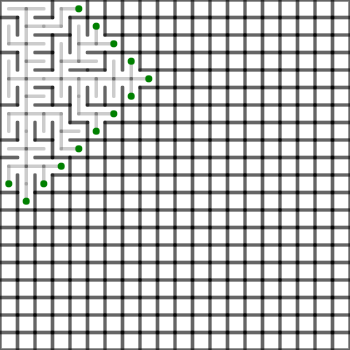
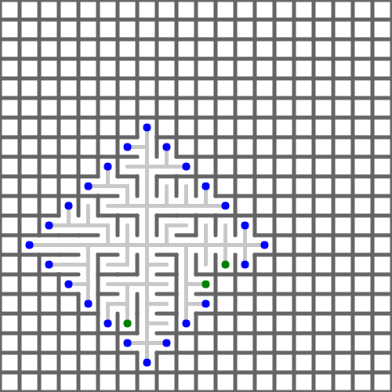
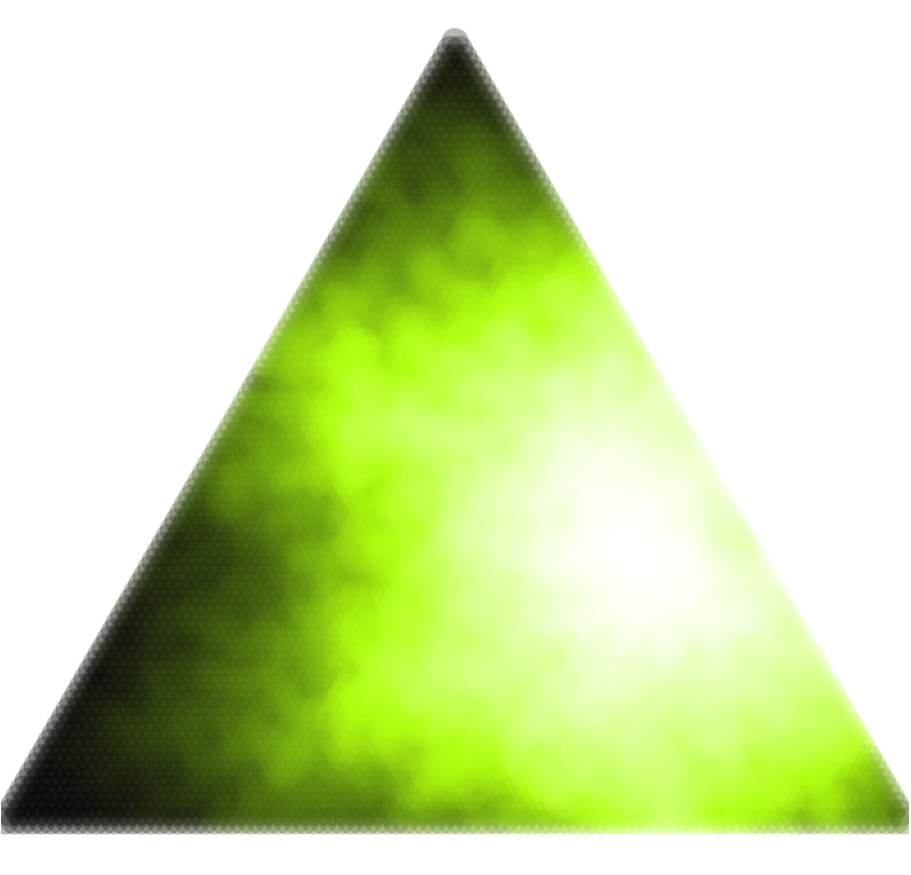
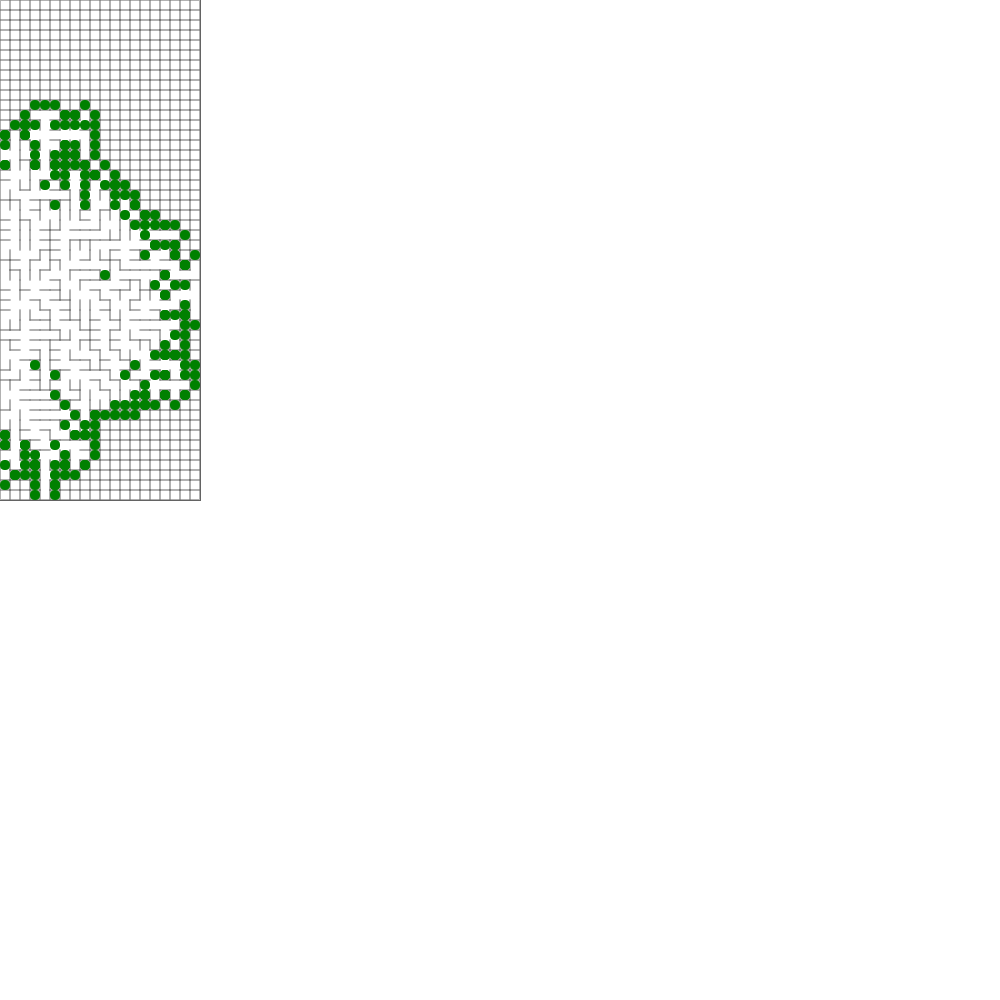

# Maze Generator

## Getting started

The repo's dependency on `canvas` requires Cairo & Pango installed. [Instructions here](https://github.com/Automattic/node-canvas#installation).

(If somehow node/npm stops working afterward, make sure you do `brew update && brew upgrade`)

Clone the repository.

```bash
npm install
npm start
# open a new terminal, and run
npm run webpack
```

Then open the `public/index.html` file in your favorite browser.

If you have questions, feel free to reach out [on twitter](https://twitter.com/jaredforsyth) or in the [discord channel](https://discord.gg/reasonml).

<!--








-->

Rather inspired by https://github.com/razimantv/mazegenerator
